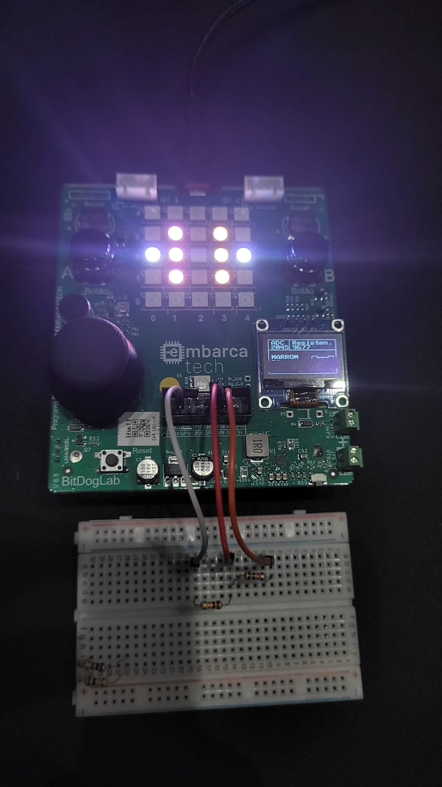

# Ohmímetro com Raspberry Pi Pico

Este projeto é um **ohmímetro digital** desenvolvido com o microcontrolador **Raspberry Pi Pico**, que utiliza um **display OLED (SSD1306)** para exibir a resistência medida, o valor estimado mais próximo da série E24 e as **cores correspondentes do resistor**.

## 🧪 Funcionalidades

- Mede resistores desconhecidos com precisão razoável.
- Estima o valor mais próximo com base na série E24.
- Exibe o valor ADC, resistência calculada e cores da faixa.
- Interface gráfica simples via display OLED.
- Modo BOOTSEL com botão para facilitar regravação.

## ⚙️ Componentes Utilizados

- Raspberry Pi Pico
- Display OLED SSD1306 (via I2C)
- Resistor conhecido de 10kΩ
- Protoboard e jumpers
- Botões (para medição e BOOTSEL)

## 📐 Como funciona

1. O resistor a ser medido forma um divisor de tensão com um resistor conhecido.
2. A tensão no ponto médio é lida via ADC do Pico.
3. A resistência é calculada pela fórmula:
4. O valor é normalizado e comparado com os valores da série E24.
5. As faixas de cores são determinadas a partir dos dígitos do valor estimado.

## 🖥️ Display OLED

As informações mostradas são:

- Valor ADC médio
- Resistência medida
- Valor estimado da série E24
- Três faixas de cor que representariam o resistor equivalente

## 🚀 Como usar

1. Monte o circuito conforme o esquema do divisor de tensão.
2. Conecte o display OLED nas portas I2C (GPIO 14 e 15).
3. Grave o código no Pico.
4. Coloque o resistor a ser medido.
5. Pressione o botão A (caso necessário).
6. Leia os valores no display.

## 📷 Imagens 

